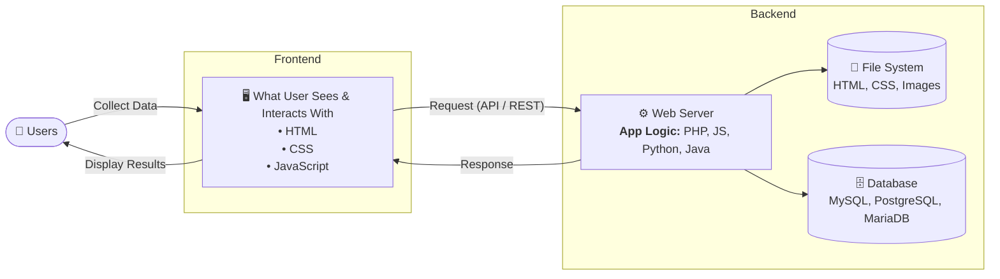
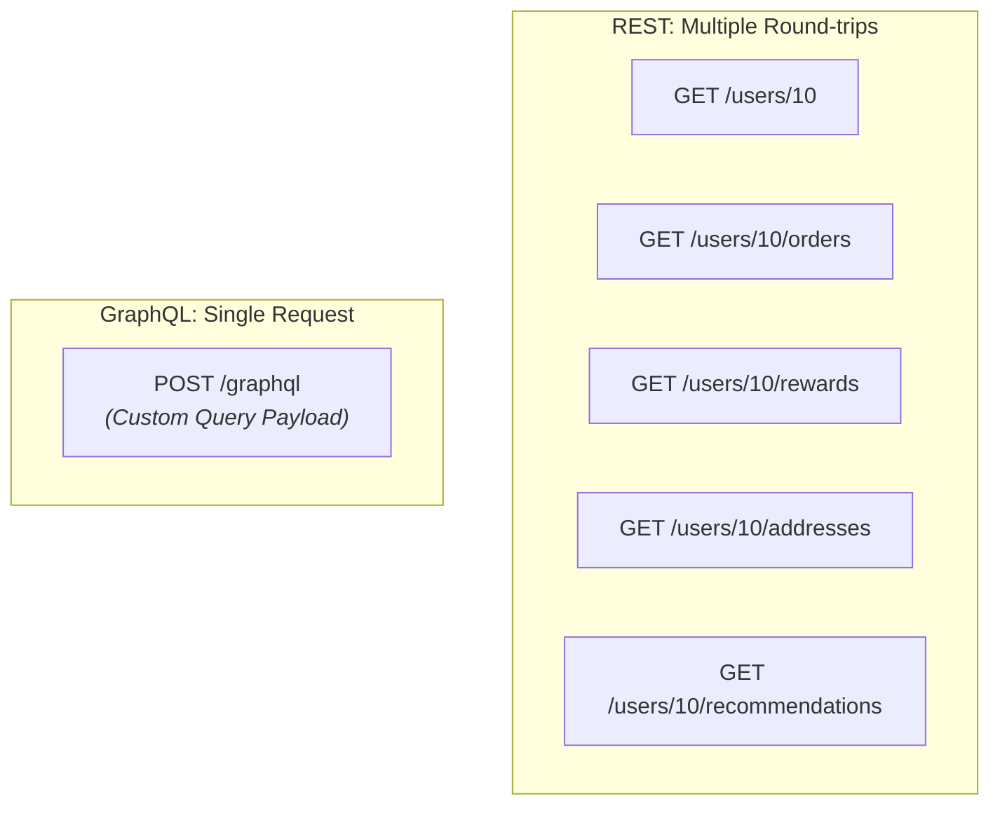
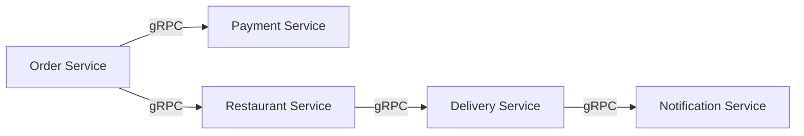
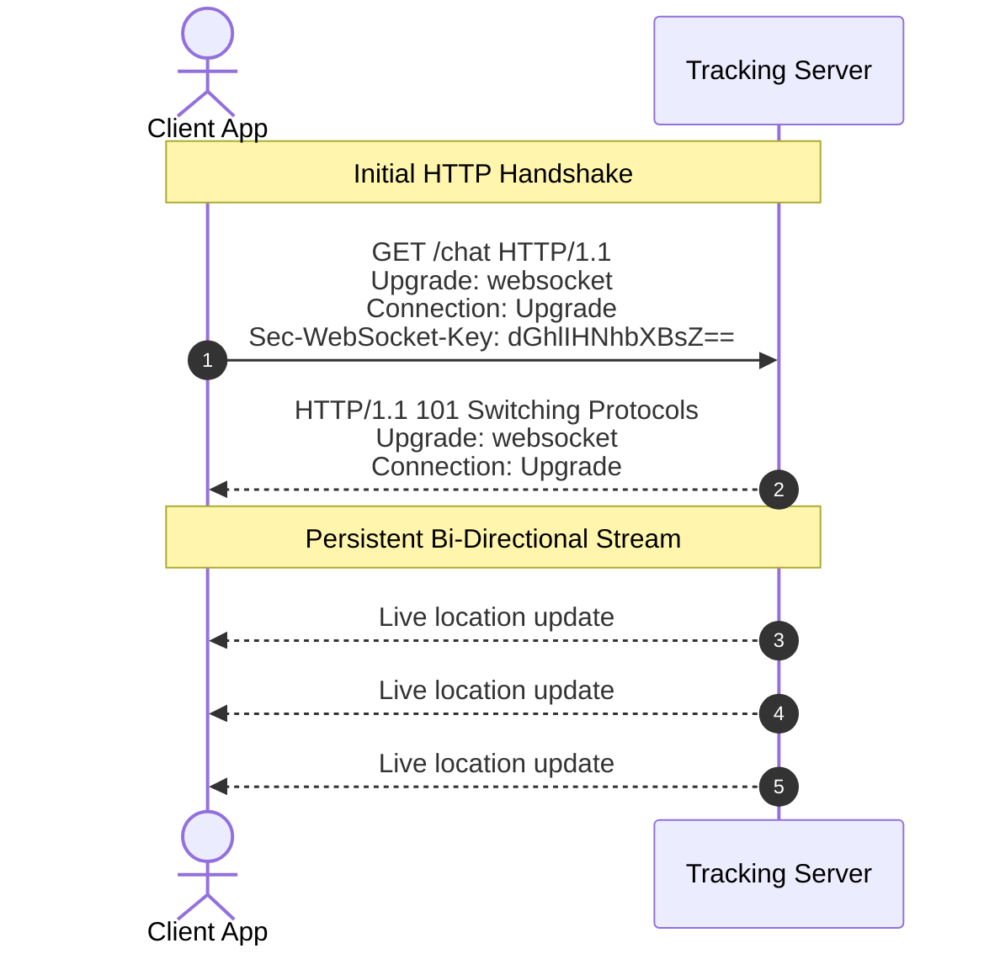
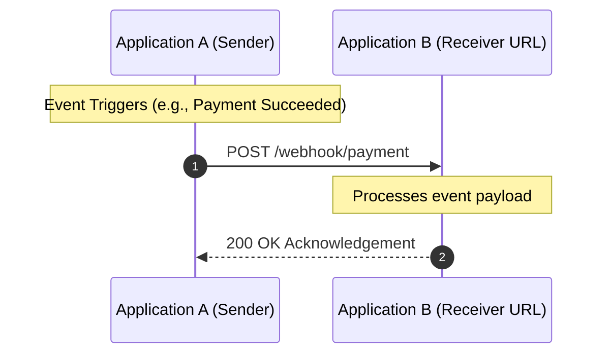

## Web Application Architecture



---

## API Architecture Styles Overview

| Protocol / Style | Primary Use Case | Characteristics |
| --- | --- | --- |
| **REST** | Standard web & mobile applications | Resource-based, HTTP methods, widely adopted |
| **GraphQL** | Complex data fetching / single-endpoint queries | Eliminates over/under-fetching, client specifies schema |
| **WebSocket** | Real-time, continuous two-way communication | Persistent full-duplex connection |
| **gRPC** | Microservice-to-microservice communication | High performance, lightweight binary serialization |
| **SOAP** | Legacy & enterprise banking systems | Strict XML-based protocol, built-in security standards |
| **Webhooks** | Asynchronous, event-driven notifications | Event-triggered HTTP callbacks |

---

## 1. REST (Representational State Transfer)

REST models data as resources and manipulates them using standard HTTP methods via specific URL paths.

* **GET** — Read/retrieve data: `GET /restaurants/101/menu`
* **POST** — Create a new resource: `POST /orders`
* **PUT** — Replace an existing resource completely
* **PATCH** — Partially update an existing resource: `PATCH /orders/501`
* **DELETE** — Remove a resource: `DELETE /cart/items/10`

---

## 2. GraphQL

Ideal for loading complex, nested views without making multiple round trips to the server.



**Single GraphQL Query:**

```graphql
query {
  user(id: 10) {
    name
    rewardPoints
    recentOrders(limit: 3)
    savedAddresses {
      city
    }
    recommendations {
      name
      rating
    }
  }
}

```

---

## 3. gRPC (Remote Procedure Calls)

Optimized for high-throughput, low-latency communication between internal microservices.



---

## 4. WebSocket

Replaces repetitive HTTP polling with an open, bidirectional connection for live data feeds (e.g., driver tracking).



---

## 5. Webhooks

An event-driven HTTP callback where the server notifies an external receiver as soon as an event occurs.



**Payload Example:**

```http
POST /webhook/payment HTTP/1.1
Host: api.example.com
Content-Type: application/json
X-Webhook-Signature: a1b2c3d4
X-Webhook-Timestamp: 1720000000

{
  "event": "payment.success",
  "orderId": 1001,
  "amount": 50000
}

```

---

## 6. SOAP (Simple Object Access Protocol)

A strict, contract-driven XML protocol standard in legacy enterprise and banking infrastructures.

```xml
<?xml version="1.0"?>
<soap:Envelope xmlns:soap="http://www.w3.org/2003/05/soap-envelope/">
  <soap:Body>
    <GetBalance>
      <AccountNumber>123456789</AccountNumber>
    </GetBalance>
  </soap:Body>
</soap:Envelope>

```
