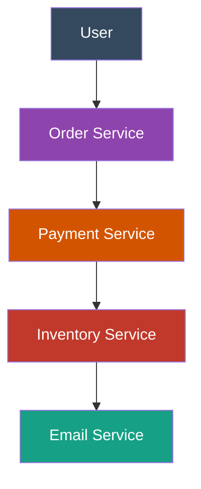

**Messaging System Overview**

A Messaging System is a middleware that allows different applications, services, or microservices to communicate with each other **asynchronously** by sending messages.

**System Flow & Components**

The core architecture consists of three main parts:

* **Producer:** The application or service that creates and sends the message.
* **Message Queue:** The intermediary that stores the messages. Key characteristics often include **FIFO** (First-In-First-Out) ordering and **Durable** storage to prevent data loss. Examples include RabbitMQ Server, Kafka Cluster, and AWS SQS.
* **Consumer:** The application or service that retrieves and processes the message from the queue.

**Sequential Service Communication (E-commerce Example)**

The image illustrates a standard microservice flow where a messaging system can decouple tasks. Instead of the user waiting for every single step to finish synchronously, an order triggers a chain of events:

**When to Use a Messaging System**

* **Decoupling Microservices:** When services need to trigger actions in other services without being tightly bound to them. If the Email Service goes down, the Order Service can still function; the messages will simply wait in the queue.
* **Asynchronous Processing:** When a task is too time-consuming to complete during a user's request cycle (e.g., generating a massive PDF report or processing a high-res video).
* **Traffic Spikes & Load Leveling:** When a system experiences sudden bursts of traffic. The queue acts as a buffer, absorbing the load so the consumers (backend workers) are not overwhelmed and can process tasks at their own pace.
* **Reliability & Durability:** When you cannot afford to lose requests. Durable queues store messages on disk until they are successfully processed.

**Real-World Examples**

* **E-commerce Checkout:** A user places an order. The *Producer* (checkout service) puts an "Order Placed" message on the queue. Various *Consumers* pick it up: one charges the credit card, one updates the database inventory, and one sends the confirmation email.
* **Food Delivery Apps:** When you order food, your app sends your location data to a Kafka cluster. Delivery drivers' apps act as consumers, pulling that real-time location data to show you how far away your food is.
* **Social Media Notifications:** When a famous user posts a photo, a message is sent to a RabbitMQ server. Background workers consume this message and fan out push notifications to millions of followers asynchronously.
