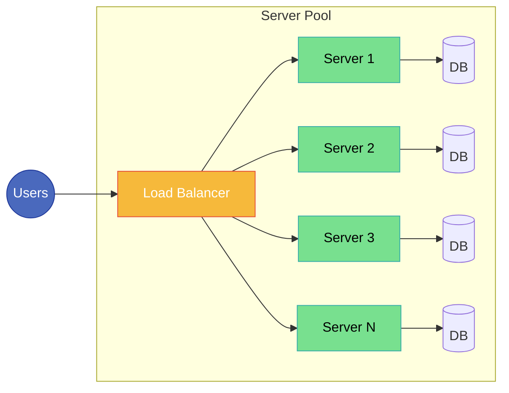
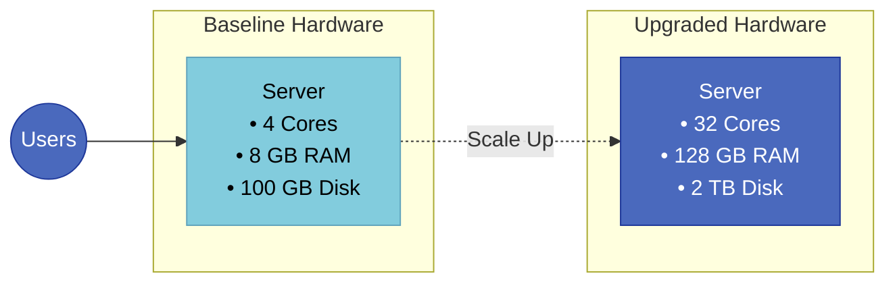

**Horizontal Scaling (Scale Out) vs. Vertical Scaling (Scale Up)**

| Feature | Horizontal Scaling (Scale Out) | Vertical Scaling (Scale Up) |
| --- | --- | --- |
| **Routing** | Traffic distribution requires a **Load Balancer** to route requests across multiple servers. | **No Load Balancer** is necessary because all requests are handled by a single machine. |
| **Fault Tolerance** | **High availability**; the failure of one server does not stop the entire system. | **Single point of failure**; everything depends on one server. |
| **Communication** | Services communicate over the network, introducing **network latency**. | Components communicate within the same machine, resulting in **faster local communication**. |
| **Data Management** | Maintaining data synchronization across servers can be **challenging**. | Data management is **simpler** since everything resides on one machine. |
| **Capacity Limits** | Can grow **almost indefinitely** by continuously adding servers. | Growth is **limited** by the maximum CPU, RAM, and storage supported by hardware. |
| **Common Use Cases** | Large-scale systems like **Netflix, Amazon, Google, and Uber**. | **Small businesses, internal tools**, and **legacy enterprise systems**. |

---

**Architecture Diagrams**

*Horizontal Scaling (Scale Out)*

*Vertical Scaling (Scale Up)*

---

**When to Use Which**

* **Choose Vertical Scaling when:**
* Building an MVP, prototype, or early-stage startup with low-to-moderate traffic.
* Running legacy monolithic software that does not support distributed execution.
* Simplicity and rapid development speed trump maximum fault tolerance.
* Managing transactional databases (e.g., standard relational databases like PostgreSQL/MySQL) where complex distributed joins and ACID compliance across multiple machines add too much engineering overhead.

* **Choose Horizontal Scaling when:**
* Traffic is rapidly fluctuating, unpredictable, or exceeds the hardware capacity of the largest commercially viable server.
* Zero downtime and high availability are hard system requirements.
* The architecture is microservices-based, containerized (e.g., Docker, Kubernetes), or stateless, allowing nodes to spin up and down dynamically.

---

**Real-World Examples**

* **Vertical Scaling Example:** An internal company CRM or HR portal serving 200 employees. When the system slows down at the end of the quarter during performance reviews, the IT team increases the cloud instance from an AWS `t3.medium` (2 vCPUs, 4 GB RAM) to an `m5.2xlarge` (8 vCPUs, 32 GB RAM) rather than refactoring the code to work across multiple nodes.
* **Horizontal Scaling Example:** An e-commerce platform during Black Friday. Anticipating millions of simultaneous visits, an auto-scaling group behind an Elastic Load Balancer spins up the frontend web servers from 5 instances to 50 instances. If any individual instance crashes under the spike, the load balancer redistributes traffic to the surviving 49 instances without downtime.
