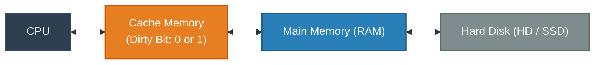

**Cache Write Policies: Write-Through vs. Write-Back**

When a CPU modifies data residing in a cache line, it must maintain consistency with the backing store (Main Memory / RAM). The two core cache write policies determine when and how that update is propagated.

---

**Architecture Flow Diagram**

---

**Key Differences**

| Feature | Write-Through Policy | Write-Back Policy |
| --- | --- | --- |
| **Write Operation** | Data is written **simultaneously** to both the Cache and Main Memory. | Data is updated **only in the Cache** initially. Main Memory is updated later. |
| **Dirty Bit Requirement** | **Not needed** (Cache and Main Memory stay synchronized). | **Required (`0` or `1`)** to track whether a cache block has been modified. |
| **Write Latency / Speed** | **Slower writes** due to constant bus access to Main Memory. | **Faster writes** at cache speeds without waiting for RAM. |
| **Memory Bus Traffic** | **High**, because every individual write triggers a main memory access. | **Low**, writes are batched and memory is accessed only on block eviction. |
| **Data Consistency** | **High / Immediate consistency** between cache and RAM. | **Eventual consistency**; memory remains stale until the dirty block is flushed. |
| **Fault Tolerance** | Lower risk of data loss on sudden power loss/crash. | Higher risk if cache contents are lost before flushing back to RAM. |

---

**How the Dirty Bit Works (Write-Back)**

* **Clean (`Dirty Bit = 0`):** The data in Cache matches the data in Main Memory. When the cache block needs to be replaced, it can simply be discarded or overwritten.
* **Dirty (`Dirty Bit = 1`):** The CPU has updated the value in Cache (e.g., $x$ updated from $100 \rightarrow 200 \rightarrow 300 \rightarrow 400$), but Main Memory still holds the old value ($x = 100$).
* **Eviction:** When this dirty cache line is replaced by incoming data, the cache controller flushes the final value ($x = 400$) back to Main Memory and resets the bit.

---

**When to Use Which**

* **Use Write-Through when:**
* Data loss cannot be tolerated even for a few cycles (e.g., mission-critical embedded systems).
* Simplicity of cache controller design is a priority.
* The workload is read-heavy with very infrequent writes.
* Multiprocessor coherence needs simpler tracking without managing stale states in shared RAM.

* **Use Write-Back when:**
* High-performance computing or write-heavy applications where memory write bottlenecks degrade CPU performance.
* Repeated write operations hit the same memory address multiple times in a short loop (e.g., counters or accumulators).
* Conserving bus bandwidth and power consumption is important (common in modern desktop/server L1/L2 caches and mobile SOCs).

---

**Real-World Examples**

* **Write-Back in Action (Loop Counters):** A program runs a loop incrementing an array: `for(int i = 0; i < 1000; i++) { sum += arr[i]; }`. In a **Write-Back** cache, `sum` updates 1,000 times inside the fast L1 cache at clock-cycle speed. Only upon loop exit or cache block eviction is the final `sum` written to RAM once, saving 999 unnecessary memory bus transactions.
* **Write-Through in Action (Safety-Critical Embedded Controller):** An engine ECU registers brake sensor input. Because a power interruption must not leave sensor values desynchronized between local high-speed scratchpads and system storage, a **Write-Through** policy commits changes immediately to durable memory buffers.
