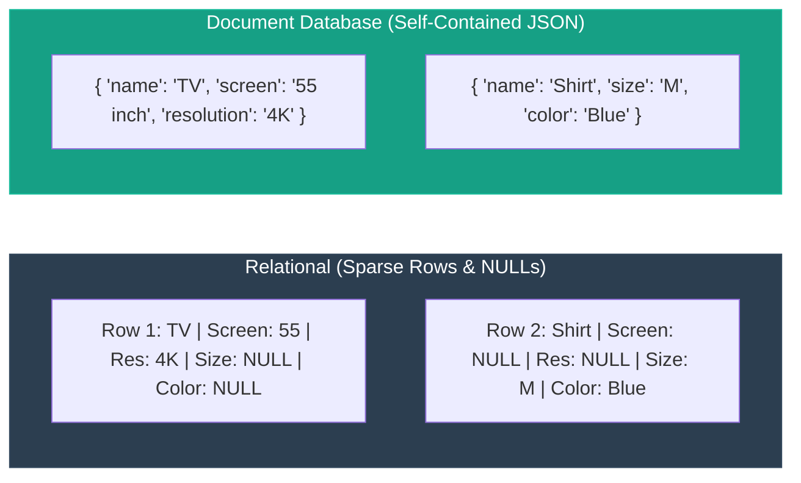
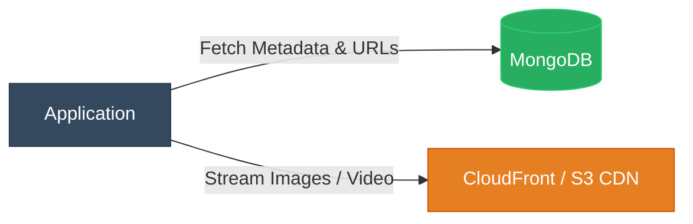

**Document Databases (NoSQL)**

A Document Database stores data as semi-structured documents (typically **JSON** or **BSON**) rather than traditional relational tables and rows.

---

**Core Characteristics**

* **Self-Contained Records:** Each document encapsulates its own fields, nested objects, and arrays without needing strict cross-table relations.
* **Flexible / Dynamic Schema:** Different documents within the same collection can contain completely different sets of attributes (e.g., a TV has `screen` and `resolution`, while a shirt has `size` and `color`). In relational databases, this results in sparse tables filled with `NULL` values.
* **Document Size Limits:** Implementations enforce upper boundaries on individual record size (e.g., MongoDB's strict **16 MB** document limit).
* **Popular Examples:** MongoDB, CouchDB, Amazon DocumentDB.

---

**Relational (RDBMS) vs. Document Model**



---

**Design Patterns Illustrated in the Slides**

**1. Handling Images and Media (Object Storage + CDN References)**
Never store raw binary media files (BLOBs) directly inside documents, as they quickly exceed the document size limit (e.g., 16 MB). Instead, store media in object storage (like AWS S3) and keep CDN URL references inside the document.

```json
{
  "id": 101,
  "name": "iPhone 16",
  "color": "White",
  "images": [
    "https://cdn.amazon.com/p101_1.jpg",
    "https://cdn.amazon.com/p101_2.jpg",
    "https://cdn.amazon.com/p101_3.jpg"
  ]
}

```



**2. Embedded vs. Normalized (Referenced) Data Modeling**

* **Embedded Pattern (Denormalized):** Store related items (e.g., product variants) within an array inside a single document.
* *Pros:* Fast atomic reads; retrieves the product and all options in one disk read without joins.
* *Cons:* Can hit the 16 MB limit if arrays grow unboundedly.


* **Normalized Pattern (Referenced):** Store each variant as its own independent document.
* *Pros:* Prevents documents from hitting size caps; easier to run atomic inventory updates on single SKU variants.
* *Cons:* Requires application-side joins or multi-document queries to fetch the complete product line.


```json
// Embedded Approach
{
  "id": 101,
  "name": "iPhone 17",
  "variants": [
    { "storage": "128GB", "color": "Black" },
    { "storage": "256GB", "color": "Black", "stock": 20 }
  ]
}

// Normalized Approach (Separate Documents)
[
  { "id": 101, "name": "iPhone 17", "color": "Black", "storage": "128GB" },
  { "id": 102, "name": "iPhone 17", "color": "Black", "storage": "256GB" }
]

```

---

**When to Use a Document Database**

* **E-Commerce Product Catalogs:** Items share few common attributes (clothing needs size/fabric; laptops need RAM/processor; books need ISBN/author).
* **Rapid Iteration / Unstable Schemas:** When requirements evolve rapidly and running costly SQL `ALTER TABLE` migrations on millions of records is undesirable.
* **Hierarchical & Nested Data:** Applications that naturally map to JSON domain objects without requiring deep relational normalization and multiple joins.
* **High-Volume Read Caching:** When you want to fetch an entire view or page payload in a single low-latency round trip.

---

**Real-World Example**

* **Amazon / Flipkart Product Catalog:** A product page needs to display details for a 4K Smart TV. Using MongoDB, the frontend makes one request and gets back technical specs (HDMI ports, refresh rate), delivery availability, and an array of high-res image URLs served via an Amazon S3/CloudFront CDN pipeline—all within a single self-contained JSON document returned in sub-5 milliseconds.
