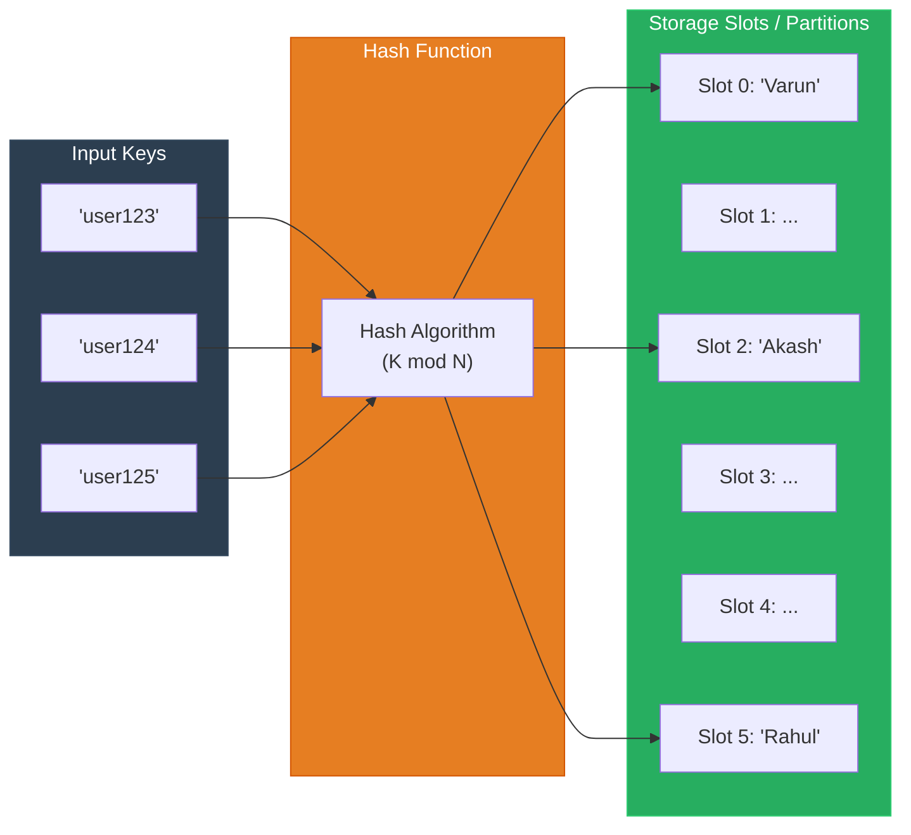

**Key-Value Database (NoSQL)**

A Key-Value Database is the simplest type of NoSQL database. It functions conceptually like a hash table or a **Python Dictionary**, pairing a unique identifier (key) with a payload of data (value).

---

**Core Architecture & Hash Slot Mechanism**

Requests lookup data using a hash function (e.g., $K \pmod N$), directing queries straight to an in-memory index or partition slot in $O(1)$ time complexity.



* **Key:** A unique string or hash identifier (e.g., `"user123"`, `"session_var123"`).
* **Value:** An opaque or semi-structured data block (e.g., string, serialized JSON blob, or binary payload).
* **Popular Technologies:** **Redis**, **Amazon DynamoDB**, Memcached, Aerospike.

---

**Primary Use Cases Listed on the Board**

* **1. Session Management:** Storing temporary user login states, tokens, and authorization flags to maintain fast authentication across distributed web servers.
* **2. Shopping Cart:** Storing ephemeral e-commerce cart selections while a customer shops before final checkout and payment commit.
* **3. OTP Verification:** Keeping short-lived One-Time Passwords with built-in TTL (Time-To-Live) expiration counters (e.g., 5-minute auto-expiry).
* **4. DNS Lookup:** High-speed mappings of domain names to corresponding IP addresses.

---

**Data Structure Example: Session State**

The board illustrates storing structured JSON-like objects under a session or user key:

```json
// Key: "Var123"
{
  "UserID": 111,
  "Name": "Varun",
  "LoggedIn": true
}

```

---

**When to Use a Key-Value Store**

* **Sub-Millisecond Latency Requirements:** When data access must occur at in-memory speeds for high-concurrency workloads.
* **Predictable Access Patterns:** When queries always search by a known key (e.g., `GET session:123`), rather than scanning or filtering across multiple nested fields.
* **Time-Sensitive / Ephemeral Data:** When records naturally expire and benefit from built-in TTL eviction policies (tokens, temporary verification codes, rate-limit counters).
* **Horizontally Partitioned Workloads:** When simple hash-key distributions can partition data evenly across multi-node clusters without complex joins.

---

**Real-World Example**

* **User Login & Rate-Limiting:** A user logs into a streaming platform like Netflix. The app creates a session key `sess:98234` containing `{"userId": 111, "tier": "premium", "device": "tv"}` stored in **Redis** with a 24-hour expiration. On every click or stream request, the API Gateway retrieves this key in less than 1 ms to confirm authentication, avoiding repetitive, costly queries to the primary relational user database.
