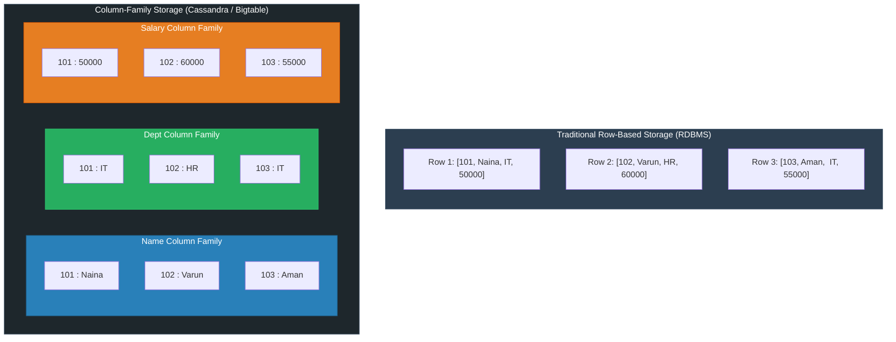

**Column-Family Database (Wide-Column NoSQL)**

A Column-Family Database stores data grouped into column families rather than traditional continuous rows. Each row key points to a dynamic collection of columns stored together on disk.

---

**Core Characteristics**

* **Columnar Grouping:** Columns are stored and managed together rather than by full sequential rows, minimizing disk I/O when reading subsets of attributes.
* **High Scalability:** Architected from the ground up for massive, multi-terabyte to petabyte distributed datasets spread across commodity hardware clusters.
* **Flexible Schema:** Rows in the same column family do not need to share the same set of columns; new columns can be added to individual rows dynamically.
* **Efficient Access:** Optimizes analytical scans and aggregations across specific attributes without loading irrelevant row data into memory.
* **Popular Databases:** **Apache Cassandra**, **Apache HBase**, **Google Bigtable**.

---

**Row-Oriented vs. Column-Family Storage**

* **Query Impact:** If you query `SELECT AVG(Salary) FROM Employees`, a row-based system scans entire disk blocks containing `EmpID`, `Name`, and `Dept`. A column-family database reads **only** the `Salary` column blocks, reducing disk reads by 70–80%.

---

**Extracted Data Representation**

*Original Logical Table:*

| EmpID | Name | Dept | Salary |
| --- | --- | --- | --- |
| **101** | Naina | IT | 50000 |
| **102** | Varun | HR | 60000 |
| **103** | Aman | IT | 55000 |

*Physically Partitioned Column Families:*

| **Name Family** |  | **Dept Family** |  | **Salary Family** |  |
| --- | --- | --- | --- | --- | --- |
| **EmpID** | **Name** | **EmpID** | **Dept** | **EmpID** | **Salary** |
| 101 | Naina | 101 | IT | 101 | 50000 |
| 102 | Varun | 102 | HR | 102 | 60000 |
| 103 | Aman | 103 | IT | 103 | 55000 |

---

**When to Use a Column-Family Database**

* **Massive Write Throughput:** When continuous, heavy write streams occur across distributed sensor networks, IoT hubs, or real-time event loggers.
* **Large-Scale Sparse Datasets:** When entities have hundreds of possible attributes, but individual records populate only a small fraction of them.
* **Analytical Scans over Specific Attributes:** When queries aggregate or process a few columns across billions of records rather than fetching complete row structures.
* **Multi-Region High Availability:** When zero-downtime, masterless multi-datacenter replication is required (e.g., Apache Cassandra’s ring topology).

---

**Real-World Examples**

* **IoT Fleet Telemetry:** Millions of connected electric vehicles stream battery voltage, speed, and GPS coordinates every second into **Apache Cassandra**. Queries aggregating battery performance across fleet models read only the `battery` column family without touching vehicle owner metadata or location coordinates.
* **Financial Fraud Analytics:** A credit card network logs hundreds of millions of daily transactions into **Google Bigtable**. Real-time scoring systems scan the `transaction_amount` and `merchant_id` columns across historical card activity to identify anomalous purchase bursts in real time.
