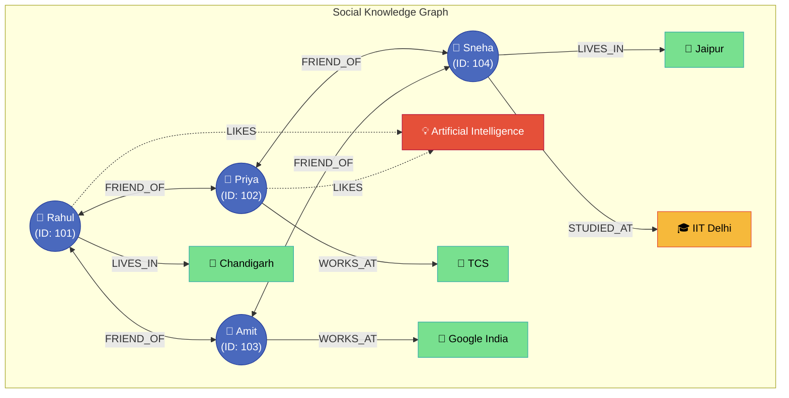

**Graph Database (NoSQL)**

A Graph Database is a NoSQL database that stores data as **Nodes** (entities) and **Edges** (relationships), making relationship-based queries extremely fast.

---

**Core Architecture & Visual Representation**

Unlike relational databases that calculate relationships at query time using expensive `JOIN` operations, graph databases store connections directly as physical pointers on disk (index-free adjacency).

---

**Graph Model vs. Relational (RDBMS) Mapping**

In a relational database, representing the graph above requires multiple tables linked via foreign keys, creating complex multi-table joins:

| Person Table |  | Friend Table |  |  | WorksAt Table |  | LivesIn Table |  |
| --- | --- | --- | --- | --- | --- | --- | --- | --- |
| **ID** | **Name** | **User1** | **User2** |  | **PersonID** | **Company** | **PersonID** | **City** |
| 101 | Rahul | 101 | 102 |  | 102 | TCS | 101 | Chandigarh |
| 102 | Priya | 101 | 103 |  | 103 | Google India | 104 | Jaipur |
| 103 | Amit | 102 | 104 |  | ... | ... | ... | ... |
| 104 | Sneha | 103 | 104 |  |  |  |  |  |

* **RDBMS Approach:** Finding "friends of friends who like AI" requires chaining 4 to 6 SQL `JOIN` statements across the `Person`, `Friend`, `Interest`, and `PersonInterest` tables, causing severe query degradation as data grows.
* **Graph DB Approach:** Traverses connected memory pointers directly across edges (`(User)-[:FRIEND_OF]->(Friend)-[:LIKES]->(Topic)`) in constant $O(k)$ time relative to graph depth, unaffected by the overall database size.

---

**Popular Technologies**

* **Neo4j** (Industry-standard native graph store using Cypher)
* **Amazon Neptune** (Managed cloud graph service supporting Apache TinkerPop Gremlin and SPARQL)
* **TigerGraph** (High-performance scalable graph DB for deep analytics)

---

**When to Use a Graph Database**

* **Social Networks:** Tracking mutual friends, followers, circles, and user feeds.
* **Recommendation Engines:** Calculating collaborative filtering patterns like *"People you may know"* or *"Customers who bought this also bought..."* based on interconnected graph paths.
* **Fraud Detection:** Detecting synthetic identities, money-mule rings, or shared stolen credit cards by identifying circular and dense transaction loops.
* **Network Routing & Logistics:** Calculating optimal routing paths, supply-chain flow paths, or dependency management trees.
* **Knowledge Graphs:** Linking semantic concepts, enterprise search domains, and entity-relationship models for AI reasoning engines.

---

**Real-World Examples**

* **LinkedIn 2nd & 3rd Degree Connections:** When browsing a profile on LinkedIn, the system displays how you are connected (e.g., *You $\rightarrow$ Rahul $\rightarrow$ Priya*). A Graph DB traversals this path in milliseconds, while a relational database would lock up attempting recursive self-joins across hundreds of millions of user records.
* **Anti-Money Laundering (Banking):** A fraud ring attempts to disguise stolen money by bouncing $10,000 across 12 different accounts before returning it to the originator. A graph query identifies this closed-loop cycle `(AccountA)-[:TRANSFERRED*1..12]->(AccountA)` in real time and freezes the accounts instantly.
