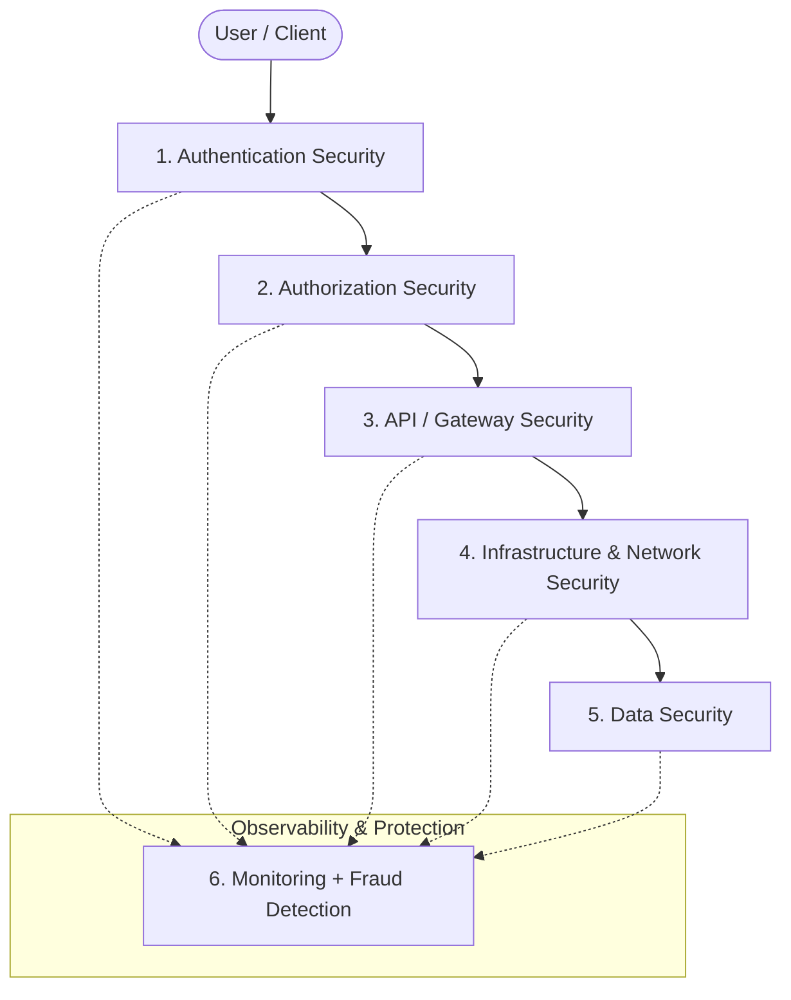

---

**1. Authentication Security**
*Verifying the identity of a user before granting application access.*

* **Core Technologies:**
* **Password Hashing:** Converts passwords into irreversible encrypted hashes before persisting to the database.
* **OTP Verification:** Validates user identity via temporary codes delivered through SMS, email, or authenticator apps.
* **MFA / 2FA:** Enforces an extra security layer (`Password + OTP`).
* **OAuth Login:** Enables users to sign in using trusted third-party providers.
* **JWT Tokens:** Generates signed tokens upon successful verification so the server can track active state.
* **Session Management:** Tracks and maintains the user's authenticated session post-login.

* **Tech Stack:** `OAuth 2.0`, `JSON Web Token (JWT)`, `WebAuthn` (biometrics, passkeys, physical security keys).

---

**2. Authorization Security**
*Controlling what actions, resources, and endpoints an authenticated identity can reach.*

* **Core Concepts:**
* **RBAC:** Grants rights according to predefined user roles (e.g., Admin, Customer, Driver, Employee).
* **Permissions:** Dictates granular operations allowed per role (`Create`, `Read`, `Update`, `Delete`).
* **Access Scopes:** Restricts service boundaries or APIs based on active credentials.
* **Internal Service Permissions:** Enforces isolation between microservices and internal subsystems.

* **Implementation Patterns:**
* **JWT Claims:** Embeds roles and permissions directly inside the signed token payload, eliminating redundant database calls.
* **Database Permission Checks:** Queries ownership, privileges, and table-level access rules before returning sensitive data.

---

**3. API Security (Protecting Backend Entry Points)**
*Securing inbound requests before traffic hits application servers and internal stores.*

| Control Area | Function / Mechanism |
| --- | --- |
| **API Gateway** | Acts as the central traffic director to route, filter, authenticate, and secure requests. |
| **Token Validation** | Verifies incoming JWTs or OAuth tokens to block unauthorized callers. |
| **Rate Limiting** | Sets strict request thresholds per IP or user within specified windows. |
| **Request Validation** | Sanitizes payloads for schema conformance, required fields, and injection patterns. |
| **DDoS Protection** | Absorbs and neutralizes malicious, high-volume distributed traffic surges. |
| **Core Tooling** | `NGINX`, `Kong Gateway`, `Cloudflare` (CDN, WAF, Edge security). |
| **Industry Usage** | **Uber** (Rides, payments, location APIs) • **Netflix** (Media streaming, recommendation feeds). |

---

**4. Data Security**
*Shielding sensitive records, archives, and persistent volumes from leakage, theft, or corruption.*

* **Password Hashing:** Implements salted, irreversible one-way hashes so plaintext secrets cannot be extracted if compromised.
* **Encryption at Rest:** Converts stationary disk blocks and tables into unreadable cipher text without valid keys.
* **Database Access Rules:** Enforces least-privilege policies to isolate database handles to approved services and identities.
* **Backup Encryption:** Secures cold snapshots and archival storage against offline decryption attacks.
* **Primary Tech:** `Argon2` (GPU- and brute-force-resistant password hashing), `AES` (Advanced Encryption Standard for volumes and backups).

---

**5. Infrastructure + Network Security**
*Locking down hosting clusters, container runtimes, subnets, and transfer routes from intrusion.*

* **Protocols & Controls:**
* **HTTPS / TLS:** Mandates transit-layer encryption between clients, load balancers, and application nodes.
* **Firewalls:** Filters incoming and outgoing IP/port traffic using strict access control lists (ACLs).
* **Private VPC Network:** Quarantines microservices into internal subnets with no public internet ingress.
* **Internal Service Isolation:** Isolates microservice-to-microservice traffic inside software-defined network perimeters.
* **Secrets Management:** Secures API credentials, database keys, and TLS certs inside isolated vaults.

* **Core Tooling:** `AWS`, `Google Cloud (GCP)`, `Docker`, `Kubernetes`.

---

**6. Monitoring + Fraud Detection**
*Real-time inspection of network events, account behavior, and transaction pipelines to detect threats.*

* **Detection Mechanisms:**
* **Anomaly Detection:** Identifies abnormal throughput, spike shifts, or foreign user behavior.
* **Log Monitoring:** Continuously parses application, server, and network logs for malicious footprints.
* **Behavior Analysis:** Identifies credential-stuffing attacks, bot farms, account takeovers (ATO), and payment abuse.

* **Common Use Cases:**
* **Uber:** Detects spoofed GPS coordinates, rogue drivers, ride manipulation, and multi-accounting.
* **Zomato:** Identifies coupon abuse, fake orders, fraudulent restaurant listings, and referral loops.
* **Amazon:** Mitigates fake review campaigns, seller hijackings, payment fraud, and checkout bot rings.
