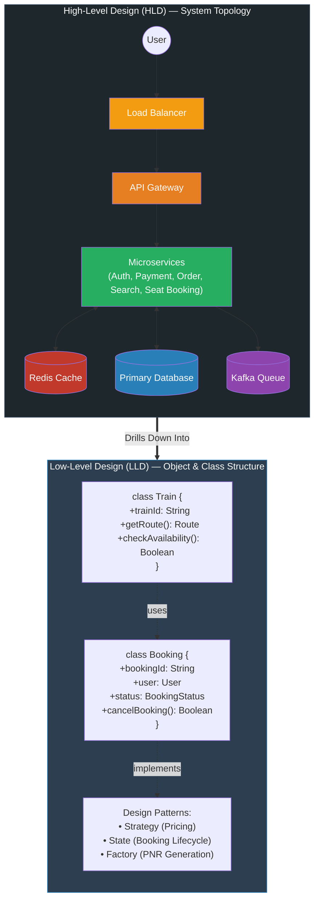

**High-Level Design (HLD) vs. Low-Level Design (LLD)**

| Dimension | High-Level Design (HLD) | Low-Level Design (LLD) |
| --- | --- | --- |
| **Perspective** | **Macro Architecture** (System-wide view) | **Micro Implementation** (Code & component view) |
| **Key Focus Areas** | Services, network traffic, scalability, reliability, databases, caching, message queues | Classes, objects, interfaces, design patterns, method relationships, DB schema, business logic |
| **Key Questions Asked** | *How do services interact? How does data flow? How do we scale under load?* | *How is the code organized? Which patterns ensure clean, maintainable logic?* |
| **Core Components** | Load Balancers, API Gateways, Microservices, Caches (Redis), Distributed Queues (Kafka) | Class diagrams, data models, state machines, algorithmic workflows, interface contracts |
| **Primary Audience** | System Architects, DevOps/SREs, Tech Leads, Engineering Directors | Software Engineers, Developers, Code Reviewers |

---

**HLD vs. LLD Architectural View**

---

**Problem Space Comparison: Railway Booking System (e.g., IRCTC)**

The board illustrates the division of responsibilities using a train ticket reservation system:

* **High-Level Design (HLD) Problems:**
* *Concurrency & Locks:* How do we prevent double-booking across distributed instances?
* *Traffic Surges:* How do we handle massive flash-crowd spikes (e.g., Tatkal rush)?
* *Service Scaling:* How do we scale the Search Service independently from the Booking Service?
* *Distributed Transactions:* How do we orchestrate payment rollbacks across services (e.g., Saga pattern)?
* *Technology Selection:* Why choose SQL over NoSQL for ACID transactions? Why use Redis for seat holding? Why use Kafka for notification fan-out?

* **Low-Level Design (LLD) Problems:**
* *OOP Modeling:* How do we design the `Train` class, `Station` class, and `Booking` class?
* *State Transition Logic:* How will the ticket cancellation workflow modify seat counts and trigger refunds?
* *Patterns:* Which design patterns apply (e.g., State Pattern for booking states like `WAITLIST`, `RAC`, `CONFIRMED`)?
* *Data Modeling:* How do we model a priority waitlist queue in code?
* *Algorithms:* How do we generate unique, non-colliding PNR identifiers?

---

**When to Focus on Which**

* **Focus on HLD when:**
* Defining capacity requirements, bandwidth constraints, and compute footprints.
* Deciding boundaries between teams and autonomous microservices.
* Evaluating infrastructure costs, multi-region availability, and disaster recovery.
* Choosing data stores based on read/write access patterns and CAP theorem trade-offs.

* **Focus on LLD when:**
* Moving from architectural specifications into sprint implementation.
* Writing maintainable, testable code adhering to SOLID principles.
* Designing clean API interfaces, schemas, and in-memory data structures.
* Preventing memory leaks, race conditions, and unhandled execution paths within a service.

---

**Real-World Example**

* **Tatkal Ticket Booking:**
* **The HLD Solution:** An API Gateway with Redis token-bucket rate limiting restricts abusive traffic. The Seat Booking service sits behind an elastic auto-scaling group. High-demand inventory counts live in a distributed Redis cache using atomic Lua scripts or distributed locks (Redlock) to stop double allocations before committing final bookings to PostgreSQL via Kafka event topics.
* **The LLD Solution:** Inside the Seat Booking service repository, developers write a `SeatLockManager` interface implemented by `RedisSeatLock`. A `BookingContext` class uses a **State Pattern** transitioning between `Initiated`, `SeatLocked`, `PaymentPending`, and `Confirmed`. A `PNRGenerator` utility encapsulates the hashing and encoding algorithm to output 10-digit booking references safely under multi-threaded concurrency.
