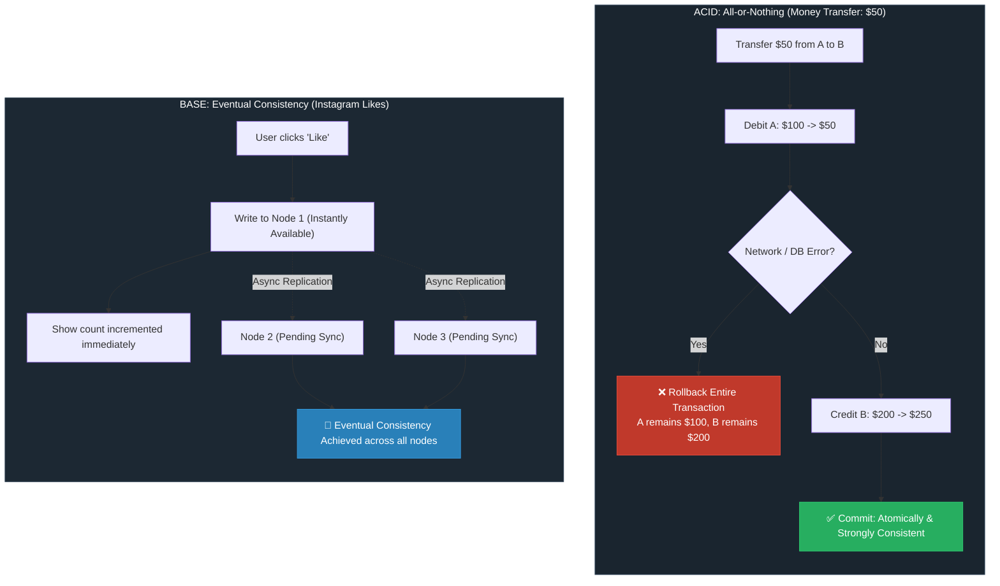

**ACID vs. BASE Database Properties**

| Property | ACID | BASE |
| --- | --- | --- |
| **Full Form** | **A**tomic, **C**onsistent, **I**solated, **D**urable | **B**asically **A**vailable, **S**oft State, **E**ventually Consistent |
| **Primary Focus** | Correctness and reliability | Availability and scalability |
| **Data Consistency** | **Strong consistency** (every read receives the most recent write) | **Eventual consistency** (data synchronizes across replicas over time) |
| **Transaction Style** | **All or nothing** (any failure rolls the entire transaction back) | **Partial/temporary inconsistency allowed** |
| **Common System Type** | **SQL / Relational databases** (PostgreSQL, MySQL, Oracle) | **NoSQL / Distributed systems** (Cassandra, DynamoDB, MongoDB) |
| **Best For** | **Banking, payment processing, ticket booking** | **Social media, likes, news feeds, telemetry/analytics** |
| **Reference Example** | **Money transfer** | **Instagram likes** |

---

**Conceptual Model & Trade-Offs**

---

**Detailed Acronym Breakdown**

* **ACID (Pessimistic / Strict Consistency)**
* **Atomicity:** Every transaction executes completely or aborts entirely without partial state updates.
* **Consistency:** Data must satisfy all database constraints and relational rules before and after committing.
* **Isolation:** Concurrent transactions operate independently without interfering with one another.
* **Durability:** Committed transactions persist permanently to non-volatile storage, surviving crashes.

* **BASE (Optimistic / High Availability)**
* **Basically Available:** The system ensures availability of data by spreading read/write requests across distributed nodes, even if individual nodes fail.
* **Soft State:** Node states can drift and fluctuate over time without active user interaction due to background synchronization.
* **Eventually Consistent:** Given sufficient time without new updates, all replicas eventually sync to identical values.

---

**When to Use Which**

* **Choose ACID when:**
* A calculation error or out-of-order write produces direct financial, legal, or inventory loss.
* Immediate data correctness is mandatory across all reading clients.
* System data is centralized or manageable within a single-master relational architecture.

* **Choose BASE when:**
* High uptime and sub-second write response times across global regions take priority over immediate precision.
* The business tolerates temporary data staleness (e.g., viewing an outdated count for a few seconds causes no harm).
* Partition tolerance is non-negotiable across large, multi-datacenter clusters.

---

**Real-World Examples**

* **ACID Example (Banking Transfer):** Account A has $100 and transfers $50 to Account B ($200). If the server crashes after debiting Account A but before crediting Account B, the entire transaction rolls back. Account A is restored to $100; money is never lost or generated out of thin air.
* **BASE Example (Instagram Post Likes):** A celebrity posts a reel. Millions of users tap "Like" simultaneously. Replicas across the US, Europe, and Asia record the writes independently. One user might see 245,102 likes while another sees 245,080. The system remains fully available, resolving to the identical, exact count after background replication catches up.
