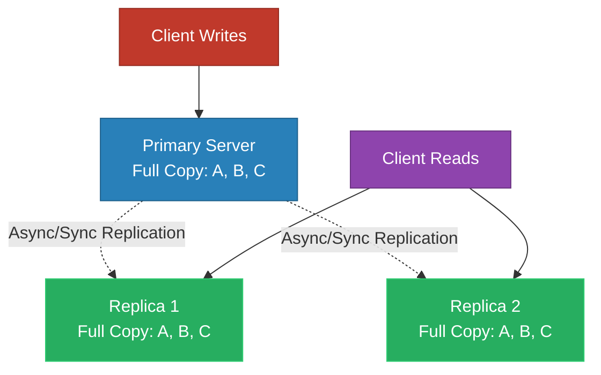
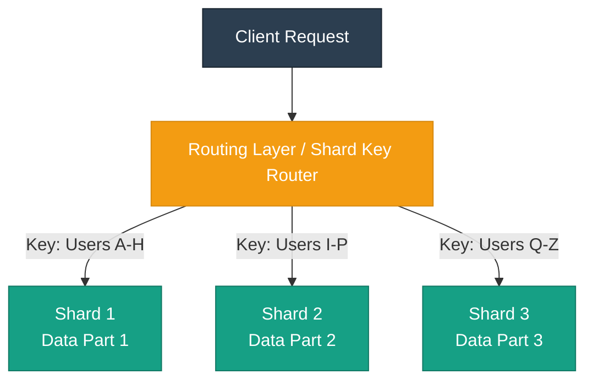

**Database Scaling: Replication vs. Sharding**

| Feature | Replication | Sharding |
| --- | --- | --- |
| **Meaning** | Copying the **same data** across multiple servers | **Dividing data into parts** (partitions) across servers |
| **Data on Servers** | Same data is copied to every server | Different data subsets are stored on different servers |
| **Main Purpose** | **High availability** and **read scaling** | **Storage scaling** and **write scaling** |
| **Best For** | Read-heavy workloads | Very large datasets exceeding single-node capacity |
| **Real-World Analogy** | Same notice posted on multiple notice boards | Library books divided into sections by category |
| **Failure Handling** | If one copy fails, another copy takes over | If one shard fails, that part of the data becomes unavailable |
| **Complexity** | Comparatively easier | More complex |
| **Main Challenge** | **Replication lag** | **Shard key selection**, **rebalancing**, and **cross-shard queries** |

---

**Architecture Flow Diagrams**

*Replication (Read Scaling & Fault Tolerance)*

*Sharding (Horizontal Partitioning & Write Scaling)*

---

**When to Use Which**

* **Choose Replication when:**
* The complete database easily fits onto a single server's disk, but the read query volume overloads the CPU.
* High availability and zero-downtime failover are required; if the primary database fails, a read replica can be promoted immediately.
* Disaster recovery across geographical regions is necessary.

* **Choose Sharding when:**
* The total data volume exceeds the physical RAM or disk storage of the largest available enterprise server.
* Write throughput saturates the IOPS capacity of a single master node.
* Cost constraints prevent vertical hardware upgrades, making distributed horizontal machines necessary.

---

**Real-World Examples**

* **Replication Example (Content Publishing / News Sites):** A news portal publishes articles once, but millions of readers load the home page simultaneously. A primary PostgreSQL database accepts new articles and replicates them to five read-only replicas behind a pooler (e.g., PgBouncer), offloading 95% of traffic away from the primary instance.
* **Sharding Example (Global Messaging / Chat Platforms):** A chat service like WhatsApp processes billions of messages per day. Storing every message on one machine is impossible. The system shards conversations using `user_id` as the **shard key**; users `0–10M` live on Shard cluster 1, `10M–20M` on Shard cluster 2, spreading both storage and write operations across hundreds of independent physical nodes.
