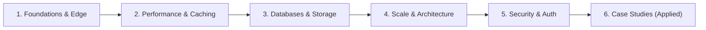

## 📚 Core Pillars

### 1. 🌐 Networking & Edge

* **Client-Server Architecture:** Protocols, sockets, and connection lifecycles.
* **DNS Resolution:** Hierarchical resolution, anycast routing, and record types ($A, AAAA, CNAME$).
* **HTTP / HTTPS:** HTTP/1.1 vs HTTP/2 vs HTTP/3, TLS handshakes, and SSL termination.
* **Latency & Throughput:** Bandwidth constraints, packet loss, and TTFB optimization.
* **Edge Delivery:** CDN push vs pull strategies, geographic edge caching.
* **Proxies & Load Balancing:** Forward vs reverse proxies, L4 vs L7 load balancing algorithms (Round Robin, Least Connections, Consistent Hashing).

### 2. 🔌 API Design & Management

* **Architectural Styles:** REST, gRPC, WebSocket, GraphQL, and Webhooks.
* **HTTP Semantics:** Method idempotency (GET, POST, PUT, PATCH, DELETE) and standardized status codes.
* **API Gateway Pattern:** Unified entry points, SSL offloading, dynamic routing, and observability.
* **Rate Limiting & Traffic Shaping:** Token Bucket, Leaky Bucket, Fixed Window, and Sliding Window Log algorithms.
* **Authentication & Authorization:** Stateful Sessions vs Stateless Tokens (JWT internals, claims, signature verification).

### 3. 💾 Databases & Storage

* **SQL vs NoSQL Paradigms:** Relational engines vs Key-Value, Document, Columnar, and Graph stores.
* **ACID vs BASE:** Transaction guarantees vs Eventual Consistency models.
* **Scaling Data Stores:** Vertical scaling vs Read Replicas vs Horizontal Partitioning / Sharding.
* **Database Internals:** B-Trees, LSM-Trees, Indexing strategies, and query optimization.
* **Theoretical Foundations:** CAP Theorem (Consistency, Availability, Partition Tolerance) and PACELC Theorem.

### 4. ⚡ Caching & Performance

* **Caching Tiers:** Client cache, CDN, API Gateway cache, Application in-memory cache, Distributed cache (Redis/Memcached).
* **Caching Patterns:** Cache-Aside, Read-Through, Write-Through, Write-Back (Write-Behind).
* **Eviction Policies:** LRU (Least Recently Used), LFU (Least Frequently Used), FIFO, and TTL configurations.
* **Cache Traps:** Cache Stampede (Thundering Herd), Cache Penetration, and Cache Breakdown mitigations.

### 5. 🧩 Distributed Systems & Messaging

* **Monolith vs Microservices:** Domain-Driven Design (DDD), service boundaries, and RPC communication.
* **Asynchronous Processing:** Synchronous blocking vs Event-Driven architectures.
* **Message Brokers:** Distributed append-only logs (Apache Kafka) vs Traditional queues (RabbitMQ).
* **Resiliency Patterns:** Circuit Breakers, Retries with Exponential Backoff, Dead Letter Queues (DLQ), and Idempotency keys.

---

## 📖 Syllabus & Modular Breakdown



### Module 1: Introduction & System Fundamentals

* End-to-end breakdown: *What actually happens when you open a website or app?*
* Forward & Reverse Proxies, SSL Certificates, and CDN edge optimization.
* L4/L7 Load balancing strategies and health check mechanisms.

### Module 2: Performance, Traffic & Optimization

* End-to-end full-stack request pathing: $\text{DNS} \rightarrow \text{CDN} \rightarrow \text{LB} \rightarrow \text{Gateway} \rightarrow \text{Cache} \rightarrow \text{DB}$.
* In-depth Caching strategies and distributed state caching with Redis.
* Rate limiting algorithms implementation and distributed throttling.

### Module 3: Storage Internals & Data Architecture

* Structural evaluation: Relational (PostgreSQL, MySQL) vs Document (MongoDB) vs Key-Value (Redis) vs Columnar (Cassandra) vs Graph (Neo4j).
* Sharding architectures: Range-based, Hash-based, Directory-based, and Consistent Hashing.
* Primary-Replica replication, multi-region replication lag, and failover topologies.
* In-depth CAP Theorem & distributed consensus tradeoffs.

### Module 4: High-Level (HLD) vs Low-Level (LLD) Design

* Scaling dimensions: Scale-Up (Vertical) vs Scale-Out (Horizontal).
* Decoupling state: Designing purely stateless application tiers.
* Translating product requirements into HLD (Architecture diagrams) and LLD (Class diagrams, schemas, interfaces).

### Module 5: Security, Auth & Distributed Identity

* Multi-layer defense in system design (DDoS mitigation, WAF, mTLS, encryption at rest/in transit).
* Stateful server-side sessions vs stateless JSON Web Tokens (JWT).
* JWT deep-dive: Header, Payload, Signature, Claims, and Refresh Token Rotation.

---

## 🏗️ Applied Case Studies

* **Designing Instagram / Photo-Sharing Platform:** High-throughput feed generation, blob storage optimization for media, metadata caching, and fan-out on write vs fan-out on read.
* **IRCTC / Flash-Sale Ticketing (High Concurrency):** Managing massive traffic spikes, distributed locking, preventing inventory overselling, and queued transactional workflows.
* **SDK vs API Architecture:** When to expose raw REST/GraphQL interfaces vs language-specific SDK wrappers.
* **Distributed Event Streaming with Kafka:** Handling millions of real-time events, partitioning strategies, and consumer groups.

```

Would you like me to tailor any of the case studies with step-by-step low-level class designs or concrete schema definitions?

```
